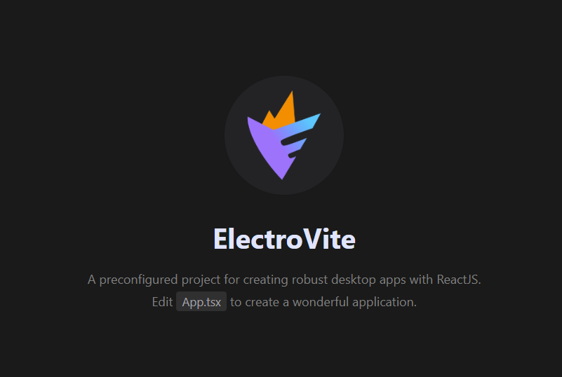

# ElectroVite, React apps with Electron & ViteJS

A prebuilt project for creating desktop apps using Electron, React, ViteJS with blazing fast hot-reload, easy to use custom import aliases & executable builds for distribution.

<br />

<p align="center">

</p>

<br />

## Features

- 🌟 Electron
- ⚛️ ReactJS
- ⚡ ViteJS
- 🌀 TypeScript or JavaScript
- 🎨 CSS / SASS / SCSS
- 📸 Images
- 🆎 Fonts
- 🧹 ESLint
- 📦 Electron Forge
- 🧩 Custom Aliases for imports
- 🔥 React Fast Refresh
- 🎁 Package Bundling (Distribution / Release)
- 🔦 Easy Directory Structure
- ⚡ Blazing Fast Hot Reload from ViteJS
- 🤖 Native Node Modules Support
- 👍🏼 Dedicated Vite Configurations

<br />

## Installation

Clone the repository:

```bash
git clone https://github.com/guasam/electrovite-react
```

<br />

Install package dependencies using [pnpm](https://pnpm.io/) or [yarn](https://www.npmjs.com/package/yarn) or [npm](https://www.npmjs.com/) :

```bash
# using yarn
yarn install

# or using pnpm
pnpm install

# or using npm
npm install
```

<br />

If you notice any errors when using `pnpm` package manager for this project, try to remove existing `node_modules` directory and install the pacakges using :

```bash
pnpm i --shamefully-hoist
```

<br />

## Custom aliases to import Components, Styles & Assets.

Ready to use aliases for importing modules, assets, stylesheets etc.

Example:

```ts
// import App from './src/renderer/components/App'
import App from '$components/App';

// import './src/renderer/styles/app.scss'
import '$styles/app.scss';
```

**Available Aliases:**

| Alias         | Target Path                 |
| ------------- | --------------------------- |
| `$src`        | `./src`                     |
| `$assets`     | `./assets`                  |
| `$main`       | `./src/main`                |
| `$renderer`   | `./src/renderer`            |
| `$components` | `./src/renderer/components` |
| `$styles`     | `./src/renderer/styles`     |

<br />

## Start Development

To develop and run your application, you need to run following command.
<br />
Start electron application for development :

```bash
yarn start
```

<br />

## Linting

To lint application source code using ESLint via this command :

```bash
yarn lint
```

<br />

## Package : Production

Customize and package your Electron app with OS-specific bundles (.app, .exe etc)

```bash
yarn package
```

<br />

## Make : Production

Making is a way of taking your packaged application and making platform specific distributables like DMG, EXE, or Flatpak files (amongst others).

```bash
yarn make
```

<br />

## Publish : Production

Publishing is a way of taking the artifacts generated by the `make` command and sending them to a service somewhere for you to distribute or use as updates. (This could be your update server or an S3 bucket)

```bash
yarn publish
```

<br />

## Packager & Makers Configuration

This provides an easy way of configuring your packaged application and making platform specific distributables like DMG, EXE, or Flatpak files.

This configurations file is available in :

```bash
tools/forge/forge.config.js
```

<br />

## Vite Configurations

All vite configurations are available for main, preload & renderer at:

```bash
tools/vite/vite.main.config.ts
tools/vite/vite.preload.config.ts
tools/vite/vite.renderer.config.ts
```
